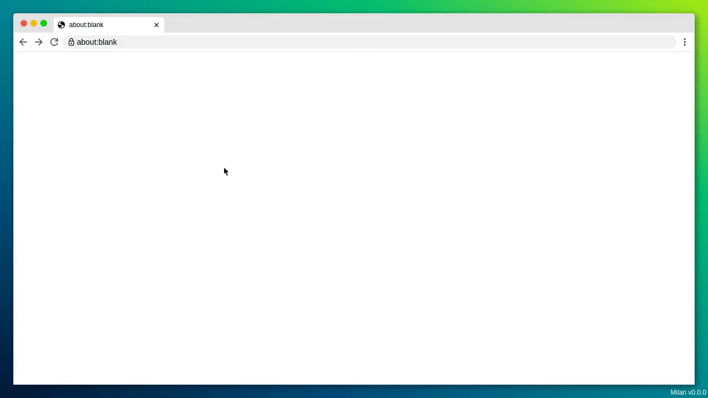

# milan

milan is a Python based browser testing and capturing tool, designed for
end-to-end testing and for creating beautiful screenshots and video clips of
web applications. To do so, milan visually emultates one or more browser
windows and a cursor, in HTML and JavaScript.



# Usage
```python
from milan import Chromium, Firefox


with Chromium.start(headless=True) as browser:

    # resize browser
    browser.resize(width=1280, height=720)

    # navigate to URL
    browser.navigate('localhost:8080')

    # start video capturing (requires ffmpeg)
    # supported formats: mp4, webm, gif
    browser.start_video_capturing('video.gif')

    # await HTML selectors
    browser.await_element('h1')
    browser.await_text('h1', 'Milan Test Application')


    # fill out forms
    browser.fill('#text-input', 'foo')
    browser.select('#select', label='Option 17')
    browser.check('#check-box', True)
    browser.click('#submit')

    # screenshot
    browser.screenshot('screenshot.png')

    # stop video capturing
    browser.stop_video_capturing()
```
