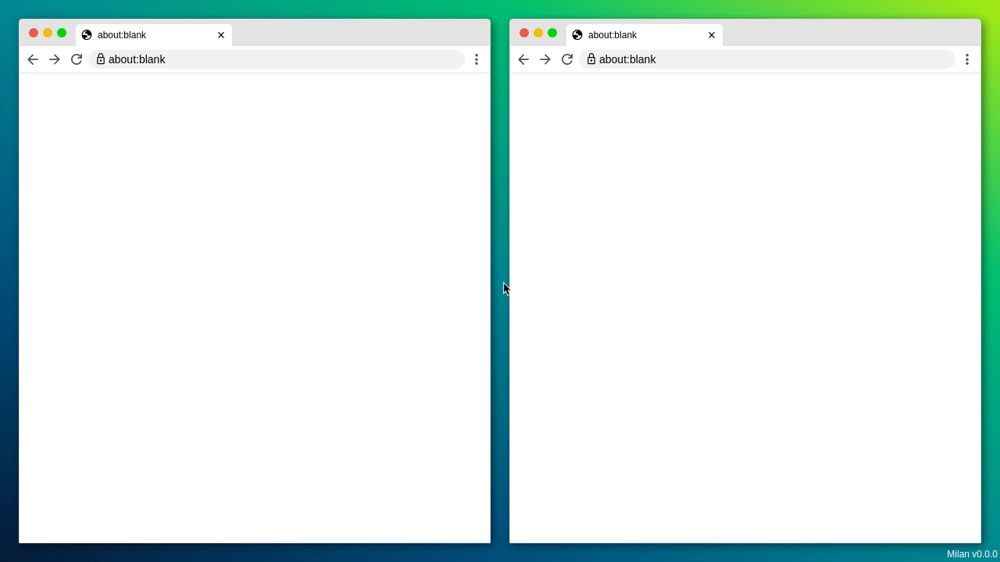
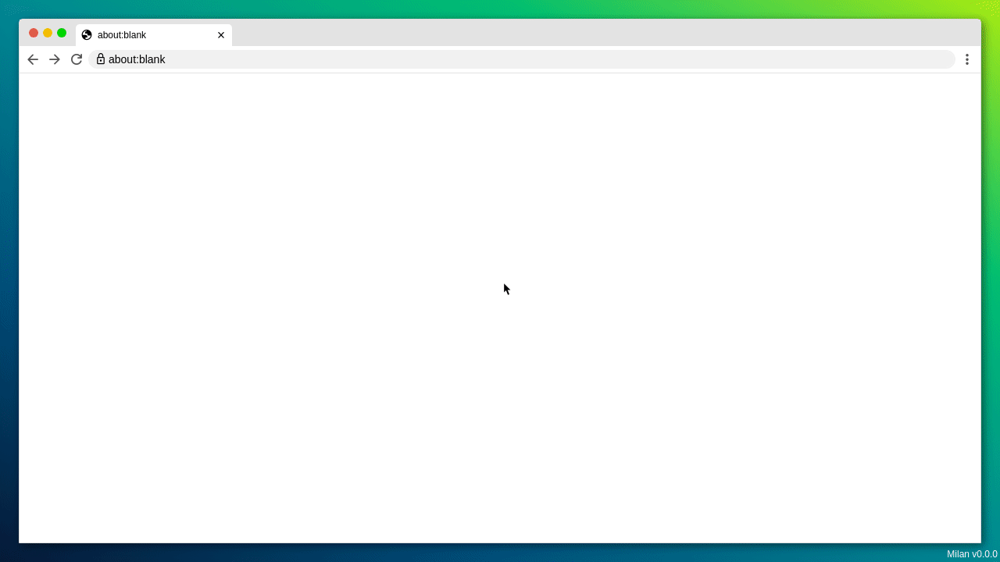

# Milan

[](https://github.com/fscherf/milan/actions/workflows/ci.yml)
[](https://codecov.io/gh/fscherf/milan)
[](https://pypi.org/project/milan/)
[](https://github.com/fscherf/milan/blob/master/LICENSE.txt)

milan is a Python based browser testing and capturing tool, designed for
end-to-end testing and for creating beautiful screenshots and video clips of
web applications. To do so, milan visually emultates one or more browser
windows and a cursor, in HTML and JavaScript.


## Usage
```python
from milan import Chromium, Firefox, Webkit


with Chromium.start(headless=True) as browser:

    # resize browser
    browser.resize(width=1280, height=720)

    # navigate to URL
    browser.navigate('localhost:8080')

    # start video capturing (requires ffmpeg)
    # supported formats: mp4, webm, gif
    browser.start_video_capturing('video.gif')

    # await HTML selectors
    browser.await_element('h1')
    browser.await_text('h1', 'Milan Test Application')


    # fill out forms
    browser.fill('#text-input', 'foo')
    browser.select('#select', label='Option 17')
    browser.check('#check-box', True)
    browser.click('#submit')

    # screenshot
    # supported formats: png, jpeg, webp
    browser.screenshot('screenshot.png')

    # stop video capturing
    browser.stop_video_capturing()
```

All browser methods can also used asynchronously when running in an async
context.

```python
from milan import Chromium, Firefox, Webkit


async with Chromium.start(headless=True) as browser:
    await browser.resize(width=1280, height=720)
    await browser.navigate('localhost:8080')
    await browser.await_text('h1', 'Milan Test Application')
    await browser.click('#submit')
```


## Demos

**Single Window** ([demos/forms.py](demos/forms.py))


**Multi Window** ([demos/multi-window.py](demos/multi-window.py))


**YouTube** ([demos/youtube.py](demos/youtube.py))

